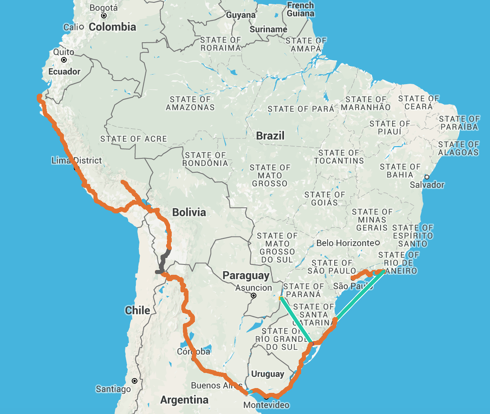

100 days in South America. Six countries with two official languages, three flights, three ferry trips, a few days of 4WDing and many MANY bus rides later we've totalled around 154 hours of long distance travel over 10850km. Lots of food and drinks, meeting a few work colleagues and new friends, and seeing what is here.

Wow. Just wow.
 

It’s unimaginable that we first landed in São Paulo fourteen weeks ago, and are now in our last stop in Peru, leaving the country to cross into Ecuador and onwards. There is so much we have seen, but so much we have not had the opportunity to see here - we’re already discussing which places we want to go to on our next trip to South America. We're a bit behind on blog posts, so we haven't blogged about everything yet - sorry for any spoilers!

Some of the highlights have been:

* Seeing the Iguassu falls, both the Argentinean and Brasilian sides
* Hiking the Inca Trail (43km and 14000 stone steps) to get to Machu Picchu
* Dee riding down Death Road and flying over the Nazca Lines (the latter of which James had already done)
* Dune buggying across massive sand dunes in Huacachina
* Seeing Christ the Redeemer and Sugarloaf in Rio, as well as visiting Copacabana and Ipanema beaches
* Crossing the Atacama desert and seeing the Salar de Uyuni
* Drinking freshly made juices of many types of that we had not seen before
* Eating lots of types of barbecue, and other local foods
* Trying a multitude of beers and cocktails
* Meeting a great bunch of people along the way, some of whom we’re run into multiple times.
* Not dying of altitude sickness, death road, plane crash, any crazy drivers, or street food! :)

According to Dee’s FitBit (before the cable disappeared) and our iPhones (after that), we have walked around 900km (1.32 million steps) since we arrived in South America, including around 80km across our first 5 days. 9km of walking a day is a fair bit, given that on some days we spent 12 hours on a bus with almost no walking!

Starting in Brasil was a hard introduction to the continent for us. We knew some Spanish and thought that would help a bit with the Portuguese, but it barely did. Although the grammar is the same and some words are similar, the pronunciation is so different that we struggled to pronounce words written in front of us on a menu! Knowing a few Red Hat people here was amazing, and we got shown around cities and everyone helped so much more than we could expect.

Brasil is an amazing country, with great food and drinks, but as a tourist we felt like we needed to constantly be on alert for pickpockets, scams and other traps. We didn’t expect many people to speak English, we were surprised how little there was in places like Rio that hosted the Soccer world cup and will have the Olympics in the middle of the year. If you come, don’t be like the two American girls who sat behind us in a resto-bar, who were vegetarian and didn’t bother to learn the words for “beef”, “vegetable” “chicken” or "vegetarian" - South America is not the easiest place to avoid meat, but you can if you make a bit of effort.

The beaches in Brasil are famous, but honestly they don’t have anything on Australian beaches. Copacabana and Ipanema weren’t bad, but not any better than those at a random seaside town on the East coast of Australia. We could however learn a few things from people taking the opportunity to sell you anything and everything. You can hire beach chairs and umbrella, with waiter service for alcoholic drinks, and roaming sales of ice creams, barbecued prawns or cheese, biscuits, sunglasses, clothing, hats, swimwear, and even painted art! In Australia there would obviously be problems with liquor licencing, but surf life saving clubs having beach chairs for hire and the occasional walking salesmen for ice creams and soft drinks would be awesome.

Unfortunately the people in Brasil, aside from the Red Hat colleagues, did not seem quite as friendly as the other South American countries, especially in Rio where there was little to no patience with people who are not fluent Portuguese speakers. Restaurant and bar staff weren't too bad, but the supermarket checkout staff were terrible. Every Brasilian we’ve met in Australia has been awesome, so we don’t know if it’s the ones who travel are like that or whether it’s us and the language issues. Brasil does make up for it with handsome guys and stunning girls (and James thinks so too), so spending time at the beach had some good sides ;)

The food in Brasil was fantastic, lots of delicious meat and tasty fresh fruits, with plenty of cheap drinks. The churrasco was as good as we hoped, and plenty of deep fried snacks for when you’re hungry (or hungover). The only down sides were too much sugar (which seems to be a pattern in South America) and the pizza not being great despite many claims that they have some of the best in the world.

There is so much of Brasil we didn’t see (it's 20% larger than Australia), so it would be great to some back and explore more, but we’ll definitely need to learn some Portuguese first!

----
Quiz time! (for English speakers):
Words ending in -ria mean “place of” in Spanish and Portuguese. Which of the following are correct translations?

* Pizzaria - place that makes pizzas
* Paneria - place that sells kitchen equipment
* Cervezeria – place that brews beer
* Bruncheria - place to eat brunch
* Fereteria - place that sells small animals

----

We did not spend long in Uruguay, but there was meat - oh so much meat! Uruguayan asado is similar to the Argentinean one, with lots of offal meats and sausages, cooked directly over charcoal. To be honest, we don’t know what other local foods they have besides meat - we just ate that and the common dishes you get everywhere. We were quite surprised with the Uruguayan wines, since we didn’t know it produced any but the reds we had were quiet decent for the price.

Being in Uruguay was much easier than Brasil since we speak some Spanish. That alone took away a lot of the every day stress, and made us feel a lot more comfortable here.

It’s hard to say whether we’d want to come back to Montevideo and Colonia del Sacramento, there wasn't much more to do, but seeing more of the country’s interior and the Gaucho lands, as well as the beaches of Punto del Este and Punto del Diablo would be nice. We probably wouldn’t have a trip just to see Uruguay again, but definitely would visit if we were in the region

While we love it over here in South America, there are some things we really miss from home. Good Asian food and good coffee are two of the big ones. Peru has had a lot of Chinese immigration for a while, and there is a Peruvian-Chinese fusion cuisine called “Chaufa” or “Chifa”, and signature dish being a variant of fried rice. Unfortunately it isn’t anything like the food we get at home, since we are now so spoiled with good Asian foods; here it is very westernised Chinese food like Australia had in the 80s. We’d love to have some pho and rice paper rolls, but the chances of finding a good Vietnamese restaurant are pretty slim in any of the countries in South America.

Argentina was a very varied place: the gaucho influences in the middle, the Andean influences in the north, and everywhere we didn’t get to see sounding like they would be different too. The country definitely has some bucket-list places we missed out on such as Patagonia, and the wine country near Mendoza would definitely be worth a visit. Given it’s the size of Western Australia, there will be even more places to visit we haven’t even heard of.

The people in Argentina were quite friendly, although we sometimes struggled with how fast they spoke their Spanish, especially in Buenos Aires. We unfortunately also missed the good weather, as the cold front heralding the arrival of late autumn appeared a few days before we got there.

One thing we didn’t think about being a big problem in South America was the size of notes you get from ATMs. On one side the largest note in Argentina is the 100 pesos note, which is worth about $9.50 Australian dollars, so when paying for anything of high value you need a big wad of notes. On the other end, most ATMs in Peru give you 100 Soles notes (although larger ones exist), which are worth about $42 Australian dollars, and people really *REALLY* don’t like you trying to pay with them. Many places don't accept them at all, and even if they do they probably don't have change. There was a restaurant where we owed 90 soles for an extended lunch with several drinks, and we got a scowl for trying to pay with a 100 and get 10 change.

We can’t really comment much on Chile since we only saw one very small town, but San Pedro was a fun place to visit. There were lots of unique things to do and see, so anyone who is in the area should come for a visit, and look at the stars and landscape.

Bolivia is full of markets sprawling on to the streets, friendly people, and not enough air. Unfortunately, because we spent longer than planned in Brazil, we had to drop some places we wanted to visit from Bolivia so that we would make it to Cusco and our Inca Trail tour in time. The parts we did see were chaotic but fun, and if we were to come back then we’d love to visit the other two cities on the gringo trail, Potosi and Sucre, and go down from the highlands to the Pampas and Amazon regions. We know a few people who visited and said it was an experience worth having.

There was not a lot of memorable food and drink in Bolivia (apart from food poisoning) and except quite unexpectedly pizza. The best pizza was not in Sao Paulo with it’s 8000 pizzarias, or Buenos Aires with it’s large number of Italian immigrants, but instead in the Andean highlands. Why? Nice thin crispy bases, a small number of high quality and fresh toppings.

One mostly great thing over here has been the road naming and numbering system, which is really helpful when you don't know the city. Road names are unique in a given city, not just the suburb, so if you say you want to go to “Calle San Martin 432” a taxi driver should know where you want to go. The street numbers are also designed with each block starting at a multiple of 100 and the remainder in meters. So that address would be 32 meters along the 5th block of the street.

The down side of the naming is that because they need to be unique, street names are also quite long with full names and titles. They are almost always abbreviated on signs and maps, and the abbreviated versions are unfortuntately not unique. One of the full street names would be “Calle General Jose de San Martin, el liberador”, but if you just know “San Martin” it may be that, or the Avenida (avenue) rather than the Calle (street) with the same ending, or one of the ones named after someone else with the same surname – that can be a major problem if you end up kilometres away at the wrong street.

Coffee naming can also be confusing, for example what a “Café Cortado” is. It literally means “short coffee” and I think it’s supposed to be a shot of espresso with some but not a lot of steamed milk. However as James’ coffee of choice over here since flat whites don't exist, there have been a lot of differences in what turns up - from what he knows as a macchiato (espresso shot with a tiny dash of milk), to what was essentially a cappuccino without the sprinkle of chocolate powder on top. Still both better than the time he ordered a cappuccino and someone attempted to steam powdered milk! :(

Perú has some of the iconic destinations people think of when you say you are going to South America, Machu Picchu first amongst those, but the country is so much more. There are many more sights and places worth visiting, but the country itself is worth experiencing.

The people here are very friendly, and there are a multitude of cultures (the Incas were just the last before the Spanish came) that still exist in daily life, especially in the highlands. Those old cultures mesh in with the fanciness of Lima and the many migrant cultures, to make a country where you should get to know the people.

Amazing food and drink is just an everyday part of visiting. Fresh fruit to eat or juice, good seafood dishes such as ceviche, some barbecued meats from the street, around 5000 types of potato, and some chilli if you want it, makes it all so delicious. You can wash it down with a pisco sour, chicha (corn juice), one of the many, many craft beers they have from local breweries - just don’t drink the tap water!

Our trip through Peru has mostly been the extended tourist trail. We could spend months more in Peru, seeing the Peruvian Amazon, more of the mountains (Salkantay trek anyone?) and the less travelled inland areas. After five weeks we are looking forward to some new things (maybe less potato and rice), and can’t wait to see Ecuador.

Although there are a lot of things that are the same as James’ last visit, there are some noticeable differences, with places being a bit more ready to handle tourists, but on the flip side some areas being a lot more overrun with tourists. There are more walking tours of cities, more English around, and fancier bus services between cities. 

Over the 100 days we've seen a lot of quirky things. These have included signs with pictures of llamas on them asking you not to use flames inside (llama also means flame apparently), a lot of weird fruits and vegetables, as well as a lot of manky bathrooms. Something Dee didn't realise before coming across to South America is that flushing toilet paper down the toilet is a definite no go area. If you do flush toilet paper down, you risk flooding the bathroom (fortunately this did not happen!). Most places have signs in multiple languages informing you of the protocol, and a bin next to the toilet which is generally overflowing and ridiculously smelly. If the bin gets full, nobody offers to let any of the cleaners know, instead throwing their paper on top of the pile, or just leaving it in the corner on the floor. If this image isn't appealing to you, wait until you see some of the toilets! Toilet seats don't exist in half of the toilets, in Brasil the toilet seats existed but were a weird memory foam, and in Argentina the front part of the toilet seat is missing altogether. In the middle of nowhere the toilets have two sections to do your business, and you need to wash it down with a bucket of water; or in one case, the toilet had no seat, no water, no toilet paper and no roof, this one cost $2aud to use. It has been one hell of an experience!

To go with the rest of the random statistics and countless beers/barbecues we've experienced here are a few more:

* Distinct car alarms heard: 1 (they are all identical... every single one!)
* Number of packets of Club Social biscuits eaten: 36 (these are a cheap snack and easy to take on the buses when they forget to feed you... or when you're hungover and fanging for food!)
* Number of craft beers drunk: you seriously don't think we've attempted to count every single beer do you? Oh right, there is an app for that - [Untappd](https://untappd.com/user/doctau) says James has recorded 56 unique beers since being in South America - this does not include the ones that Dee has drunk
* Number of Telefericos (cable cars): 3
* Number of times we've heard Beds are Burning by Midnight Oil: 58 - this is a very popular song here apparently
* Second most popular song in South America behind Beds are Burning: Guantanamera

On that topic, there are some distinctive sounds we're heard in South America. Aside from the frequent identical car alarms, in a number of cities the garbage trucks are musical. Similar to how an ice-cream van sounds. It drives along the street playing really loud music, sometimes featuring songs like Greensleeves, or Thomas the Tank Engine. We once heard a bus playing Rudolph the Red Nose Reindeer so that people would get out of the way as it's maniac driver ploughed through the streets.

After all we’ve seen in 100 days outside Australia, imagine where we could be after 200 days! If your imagination isn’t good enough to think of somewhere, how about the Moroccan desert?

---
Quiz answers:

* Pizzaria – correct: place that makes pizzas
* Paneria – incorrect: bakery: not place that sells kitchen equipment
* Cervezeria – correct: place that brews beer
* Bruncheria – correct: place to eat brunch (this may be made up through)
* Fereteria – incorrect: hardware store, not place that sells small animals

---
