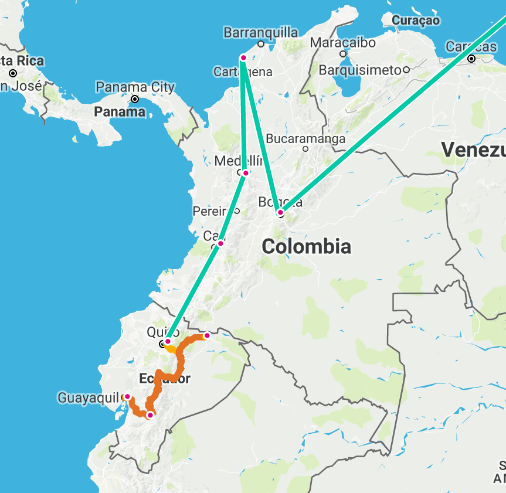
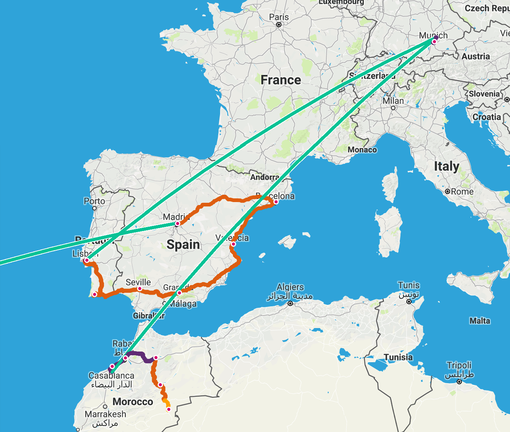

Our two hundredth night was spent sitting under the stars on a sand dune, after a camel ride to camp in the Sahara desert. Pretty good for the night!

The second hundred days had a lot of slow travel around Ecuador, internal flights in Colombia, buses and the occasional train in Spain and Portugal, more flights, and a packed minivan in Morocco. All up we had around 3560 km of overland transport and 15135 km of flying, plus around 730 km of walking around seeing things.

Some of the highlights have been:

* Going into the amazon and not being eaten or dying of malaria
* Learning more about the drug cartels and civil war in Colombia
* Finding a beach that rivals ones at home, on the Caribbean coast
* Eating tapas and other amazing food in Spain
* Helping to throw 160 tons of tomatoes with 42000 other people at La Tomatina
* Meeting up with Tristan in Portugal, and eating a lot of food, especially amazing seafood
* Catching up with Caitlyn and drinking a lot of beer at Oktoberfest in Munich
* Visiting the medinas in Morocco, and spending a night in the Sahara

Ecuador
-------
Ecuador is a microcosm of South America: Amazon rainforest, high mountains and volcanos, beautiful beaches (although we didn't go there) and colonial cities

Ecuador seemed a lot more American than everywhere else; not Western but specifically American. Shops had English in their names, and so so many American people (especially Cuenca). The Internet in Ecuador has been absolutely terrible, the worst in South America.

There are some things we'd like to go back to Ecuador for, especially the Galapagos islands, but it's probably not somewhere we would re-visit places except on the way to the things we didn't see. The Amazon was very cool, and seeing it again would be nice, but we would probably choose to visit a different part of the Amazon, perhaps in Peru or Brazil.

Colombia
--------
Both of us agree that Colombia has been our favourite country in South America. Other places are good, such as Peru having the best old ruins, and the Iguassu falls being spectacular natural beauty, but overall Colombia has everything. The people are so friendly, and seem to enjoy that people are now coming to visit their country, no longer scared by the events of the second half of the 20th century.

There weren't many stand-out dishes in Colombia unlike some of the other parts of South America, but the food was generally good, and the variety of fresh fruits great. Colombia is somewhere we would love to come back to, especially now that our government has lowered the travel warnings. Seeing the "coffee triangle", doing the hike to Ciudad Perdida (at least for James), and more of the countryside would be great.

Spain
-----
Spain was a big change for us, with such fancy luxuries as hot water in sinks
 (washing dishes and shaving is so much easier), and toilets you can put paper down! Despite the previous four months being in Spanish speaking countries, language here wasn't easy – the accent is very different, especially in the parts where c/s/z letters have a "th" sound, kind of like a lisp. Then you get to the Catalonia region where their preferred language isn't even (Castillian) Spanish, it's Catalan.

The food in Spain was generally great, especially in the areas that do proper tapas like Grenada, and you get a delicious bit of food with every drink you order. In some other areas it was a few olives or you had to pay. Obviously the wine is good in Spain too, and so cheap.

The festival of La Tomatina was incredibly fun, we definitely recommend anyone who has the chance to do it. The Festivals All Around group we went with turned out to be a great choice, and we'd strongly recommend them too.

It was interesting when we arrived into the south of the country, seeing the major Arabic influences such as Moorish architecture. It is quite beautiful; especially some of the grand palaces that still exist.

There is so much to see here, we barely scratched the surface. I think if we spent the whole year trip in Spain we would still have not seen that much of it. We are definitely coming back to Europe some time, and I think we are going to visit Spain again.

Portugal
--------
We only spent a short amount of time in Portugal, but it was a fun time. The stay began on the Algave coast with it's amazing beached and coastline. It was very touristy, full of English people coming for the summer, to the point where not all of the restaurants even had menus in Portuguese! There is a lot to see in the region, and like Spain we could spend much more time enjoying the sun here.

Lisbon was a very cool place, made better by having Tristan to catch up with. There is so much history here, the heart of the Portuguese empire. The food was amazing as well, we were very lucky to get an AirBnB that was a short walk from a "market" with a "restaurant in a food court" atmosphere. They were expensive, but the scarlets prawns were definitely worth it.

Germany
-------
Germany was always going to be a different experience, since we were pretty much only visiting to go to Oktoberfest. With Keagan bailing out of his trip over to here and Morocco, we were lucky that James' sister Caitlyn was flying to London to move around the time, and joined us in the festivities.

Beer, dirndls, beer, leiderhosen, beer, pork knuckle, beer, sausages, beer. No more explanation is necessary!

Aside from Oktoberfest, the visit to the Dachau concentration camp memorial site was a sobering and moving experience. There isn't much to say, simply that if you are in the area, it is worth visiting one of the memorial sites.

Morocco
-------
Neither of us knew what to expect going to Morocco. We both like Moroccan food, or at least the Australianised version of it, and James has seen and read plenty from Pip who he went to college with. It was also one of the two proper tours we were going on for the trip; as neither of us speak Arabic, French (or Berber) and we had limited time for the places to visit, we decided to go on an Intrepid tour.

The tour was a lot of long days in the mini-van, and the group had its personality conflicts, which didn't ruin the trip but it did affect it. There were some lovely people, but the conflicts became tiring especially combined with the amount of travel. Morocco had a lot of interesting things to see, although at times we felt like we were being dragged from one shop who gave a commission to the guide to another one.

The food was mostly not what we expected either, a lot less spices and flavour than any of the Moroccan food we have had at home, either in restaurants or cooked ourselves. The one exception was when Aziz (our Intrepid guide) organised a small lunch with a few of us, cooked by a lady at the riad. That was delicious.

It'd hard to say whether Morocco was not as great as we had thought, we had hyped it up too much in our minds, or the tour made it less authentic and not as good. We might come back to Morocco some time, but it wouldn't be on that kind of tour.

After all we’ve seen in 200 days outside Australia, imagine where we could be after 300 days! If your imagination isn’t good enough to think of somewhere, how about on the Honduras bay islands?

